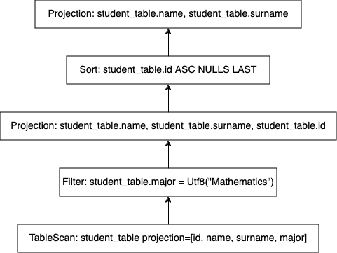

# Query Optimization - Part 1

In this series of blog posts. I will talk about query optimization in general. However, before doing so; In this blog post we will cover

- SQL
- Logical Plan, Physical Plan
- How to read a Plan
- Motivating Example for query optimization

These topics will lay the foundation for query optimization, will establish a common vocabulary and hopefully make reader motivate for subsequent parts.

In subsequent parts: I plan to cover following optimizations:

- Filter Push-down
- Projection Optimization
- Sort Optimization and Ordering Propagation
- Parallelization of the plan execution
- Common Sub-expression caching
- Join re-ordering


## What is SQL:

SQL (Structured Query Language) is a descriptive language that is used to interact with databases. An SQL query specifies the desired output by the user. However, it doesn’t specify how to calculate desired output during execution. As an example, following SQL query:

  

```sql
SELECT name, surname
FROM student_table
WHERE major='Mathematics'
ORDER BY id;
```

can be translated to english as 
>Bring me the name, and surnames of the each student who majors in Mathematics where result is ordered by student id.
 
However, it says nothing about how to accomplish this. For most of the queries, especially for complex queries there are many possible ways to calculate desired result with various tradeoffs. 

From this specification, a query is pretty opaque to end user which is fine for most of the users who don’t and shouldn’t care. However, if we work on performance and optimization. We need to inspect internals of the query execution better. `LogicalPlan` and `PhysicalPlan` enables us to see what a query does, how it executes in a friendly format. 

Before continuing, in case anyone wants to try out the same queries locally. Here is the query to generate necessary table locally.

 

```sql
CREATE TABLE IF NOT EXISTS student_table(id INT, name VARCHAR, surname VARCHAR, major VARCHAR, country VARCHAR) 
     AS VALUES(103, 'Mustafa', 'Demir', 'Mathematics', 'TUR'), 
              (101, 'Jack', 'Hu', 'CS', 'US'), 
              (105, 'Gerard', 'Depardieu', 'Mathematics', 'FR'),
              (102, 'Steven', 'Smith', 'Mathematics', 'UK'),
              (104, 'Ekaterina', 'Mihailov', 'Physics', 'RUS');

```

Also please note that I execute these queries using [cli](https://arrow.apache.org/datafusion/user-guide/cli.html) tool of [Apache Datafusion](https://arrow.apache.org/datafusion/). This is the system I am most familiar with, However results and corresponding queries should be (almost) same in other query engines (configuration options might be pretty different though).

## Logical Plan - Physical Plan

A `LogicalPlan` contains the necessary logical steps to compute query result. However, this representation is in high level, and omits lots of details related to the actual execution. I like to think `LogicalPlan` more like pseudo code, where you can see the general picture without bogging down in detail or specificities. In contrast `PhysicalPlan` is more like implementation of a pseudocode in a specific language. Anyone knowing the internals of the query engine can understand what is going on (like reading a code) by reading the `PhysicalPlan`. However, for this blog post `Logical Plan` representation will be enough for our use cases. Let’s see the`Logical Plan`  Datafusion generates for the query above by executing following command:

```sql
-- Generate only logical plan
set datafusion.explain.logical_plan_only = true;

-- See the plan for query
EXPLAIN SELECT name, surname
FROM student_table
WHERE major='Mathematics'
ORDER BY id;
```

where original query is prepended with `EXPLAIN` keyword and configuration is set logical plan only mode to not clutter result with physical plan for now. Command above produces following `Logical Plan`:

```sql
+--------------+-----------------------------------------------------------------------------+
| plan_type    | plan                                                                        |
+--------------+-----------------------------------------------------------------------------+
| logical_plan | Projection: student_table.name, student_table.surname                       |
|              |   Sort: student_table.id ASC NULLS LAST                                     |
|              |     Projection: student_table.name, student_table.surname, student_table.id |
|              |       Filter: student_table.major = Utf8("Mathematics")                     |
|              |         TableScan: student_table projection=[id, name, surname, major]      |
+--------------+-----------------------------------------------------------------------------+
```

A `Logical Plan` contains the necessary steps to produce the desired result according to specifications of the SQL query, where each step is represented as single line and executes from bottom to top. To better understand this representation, let’s look the equivalent `Logical Plan` as tree.




where each arrow show the data flow during execution. These two representations are completely same. In the first representation dependency between operators are specified by the indentation level (e.g The operator(s) with 2 indentation level ahead of an operator is the child(ren) of the operator). First representation is more concise, more text friendly. However, it maybe intimidating at the start. Second representation is more friendly, however fills up lots of space. 

 Logical Plan above describes following steps in order

- Scan the each row of the original table, where only columns: `id, name, surname, major` are used.
- Among scanned rows, just keep the rows where `major` is ‘Mathematics’.
- Shuffle columns such that new column order is `name`, `surname`, `id` respectively, where column `major` is pruned also.
- Sort constructed rows according to id columns
- Shuffle columns such that new column order is `name`, `surname` respectively, where column `id` is pruned.

To see what is going on better, let’s see the data that is passed between operators. At the source(this can be a file, a kafka topic, etc.) following table resides

| id | name  | surname | major | country |
| --- | --- | --- | --- | --- |
| 103 | Mustafa | Demir | Mathematics | TUR |
| 101 | Jack | Hu | CS | US |
| 105 | Gerard | Depardieu | Mathematics | FR |
| 102 | Steven  | Smith | Mathematics | UK |
| 104 | Ekaterina | Mihailov | Physics | RUS |

`TableScan` operator emits following table to its output (where `Column=country` is pruned.)

| id | name  | surname | major |
| --- | --- | --- | --- |
| 103 | Mustafa | Demir | Mathematics |
| 101 | Jack | Hu | CS |
| 105 | Gerard | Depardieu | Mathematics |
| 102 | Steven  | Smith | Mathematics |
| 104 | Ekaterina | Mihailov | Physics |

`Filter` operator emits following table

| id | name  | surname | major |
| --- | --- | --- | --- |
| 103 | Mustafa | Demir | Mathematics |
| 105 | Gerard | Depardieu | Mathematics |
| 102 | Steven  | Smith | Mathematics |

where 2^nd^, 5^th^ row in the input table is removed, since their `major` value is not `Mathematics`*.*

First `Projection` emits following table

| name  | surname | id |
| --- | --- | --- |
| Mustafa | Demir | 103 |
| Gerard | Depardieu | 105 |
| Steven  | Smith | 102 |

where `Column`: `major` is removed, then  columns are re-ordered.

`Sort` operator emit following table, where rows are re-ordered such that id column is Ascending.

| name  | surname | id |
| --- | --- | --- |
| Steven  | Smith | 102 |
| Mustafa | Demir | 103 |
| Gerard | Depardieu | 105 |

Then, final `Projection` emits following table:

| name  | surname |
| --- | --- |
| Steven  | Smith |
| Mustafa | Demir |
| Gerard | Depardieu |

where id column `id` removed. This is the result seen at the output by the user. For the query

```sql
SELECT name, surname
FROM student_table
WHERE major='Mathematics'
ORDER BY id;
```

Datafusion emits following result:

```sql
+---------+-----------+
| name    | surname   |
+---------+-----------+
| Steven  | Smith     |
| Mustafa | Demir     |
| Gerard  | Depardieu |
+---------+-----------+
```

If we carefully track data passed between operators we can see that only absolutely necessary data is passed between operators which is good. To see the difference a query optimization have, let’s see an alternative valid plan that would generate the same result.

```sql
+--------------+------------------------------------------------------------------------------------+
| plan_type    | plan                                                                               |
+--------------+------------------------------------------------------------------------------------+
| logical_plan | Projection: student_table.name, student_table.surname                              |
|              |   Filter: student_table.major = Utf8("Mathematics")                                |
|              |     Sort: student_table.id ASC NULLS LAST                                          |
|              |       TableScan: student_table projection=[id, name, surname, major, country]      |
+--------------+------------------------------------------------------------------------------------+
```

Let’s examine data passed between operators for this hypothetical plan. As before source is following table:

| id | name  | surname | major | country |
| --- | --- | --- | --- | --- |
| 103 | Mustafa | Demir | Mathematics | TUR |
| 101 | Jack | Hu | CS | US |
| 105 | Gerard | Depardieu | Mathematics | FR |
| 102 | Steven  | Smith | Mathematics | UK |
| 104 | Ekaterina | Mihailov | Physics | RUS |

and `TableScan` emits exact same table, which is:

| id | name  | surname | major | country |
| --- | --- | --- | --- | --- |
| 103 | Mustafa | Demir | Mathematics | TUR |
| 101 | Jack | Hu | CS | US |
| 105 | Gerard | Depardieu | Mathematics | FR |
| 102 | Steven  | Smith | Mathematics | UK |
| 104 | Ekaterina | Mihailov | Physics | RUS |

`Sort` operator emits following table (where rows are ordered such that `Column=id` is ascending):

| id | name  | surname | major | country |
| --- | --- | --- | --- | --- |
| 101 | Jack | Hu | CS | US |
| 102 | Steven  | Smith | Mathematics | UK |
| 103 | Mustafa | Demir | Mathematics | TUR |
| 104 | Ekaterina | Mihailov | Physics | RUS |
| 105 | Gerard | Depardieu | Mathematics | FR |

`Filter` operator emits table below:

| id | name  | surname | major | country |
| --- | --- | --- | --- | --- |
| 102 | Steven  | Smith | Mathematics | UK |
| 103 | Mustafa | Demir | Mathematics | TUR |
| 105 | Gerard | Depardieu | Mathematics | FR |

where rows that do not have `major=Mathematics` (`rows:{1,4}`) are removed as before.

Then `Projection` at the end emits following data

| name  | surname |
| --- | --- |
| Steven  | Smith |
| Mustafa | Demir |
| Gerard | Depardieu |

which is the same result as before. Unlike previous case, this plan carries lots of unnecessary data between operators. 

Let’s examine the problems in the second plan

- `Sort` operator receives whole table, then reorders its rows. Since sorting is relatively costly, we want to minimize data entering sort as much as possible. After sorting, `Filter` operator filters out some of the rows that is sorted. In this case there was no point in sorting those rows in the first place. As comparison `Sort` in the first plan receives 3 rows, however in the second plan it receives 5 rows. If the `Filter` were to prune 90% of the rows, the difference would be more dramatic. With this observation, we want `Filter` operation to be as below as possible during the execution to not carry around some rows unnecessarily.
- `Filter` operator receives `Column=id, Column=country` However, `Filter` itself doesn’t use these columns (it requires `Column=major` for its calculation). Also this column is not asked by the end user in the query (where user wants to see only `name`, `surname`). This column is passed to subsequent operator only to be pruned by projection there (This might not be important in terms of computation. However, it is important in terms of memory usage, and data traffic. Table at the source could have `100`s of columns).

In this blog post, we have analyzed two `Logical Plan`s to see the difference query optimization can make (In more complex queries difference can be much more dramatic). In subsequent posts we will analyze 

- Filter Push-down
- Projection Optimization

with these optimization steps, we can convert following naive plan

```sql
+--------------+------------------------------------------------------------------------------------+
| plan_type    | plan                                                                               |
+--------------+------------------------------------------------------------------------------------+
| logical_plan | Projection: student_table.name, student_table.surname                              |
|              |   Filter: student_table.major = Utf8("Mathematics")                                |
|              |     Sort: student_table.id ASC NULLS LAST                                          |
|              |       TableScan: student_table projection=[id, name, surname, major, country]      |
+--------------+------------------------------------------------------------------------------------+
```

to its optimized version

```sql
+--------------+-----------------------------------------------------------------------------+
| plan_type    | plan                                                                        |
+--------------+-----------------------------------------------------------------------------+
| logical_plan | Projection: student_table.name, student_table.surname                       |
|              |   Sort: student_table.id ASC NULLS LAST                                     |
|              |     Projection: student_table.name, student_table.surname, student_table.id |
|              |       Filter: student_table.major = Utf8("Mathematics")                     |
|              |         TableScan: student_table projection=[id, name, surname, major]      |
+--------------+-----------------------------------------------------------------------------+
```

where unnecessary data is not carried between operators.

## References
[Apache Datafusion Documentation](https://arrow.apache.org/datafusion/)
[Apache Datafusion Project Github Page](https://github.com/apache/arrow-datafusion)


